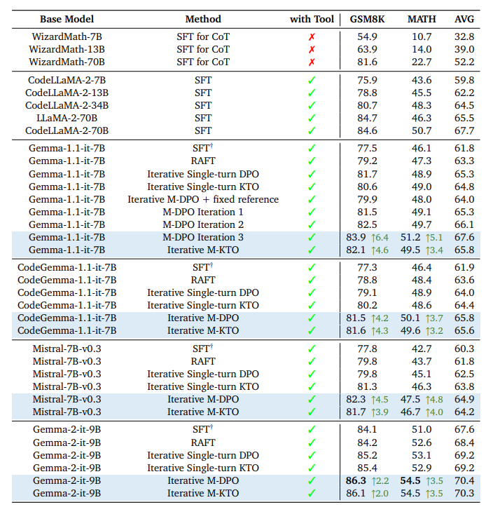

<h1 align="center">
<br>
Building Math Agents with Multi-Turn Iterative Preference Learning
</h1>

<p align="center">
TL;DL: this is the repo for "<a href="https://arxiv.org/pdf/2409.02392" target="_blank">Building Math Agents with Multi-Turn Iterative Preference Learning</a>"
</p>

We consider the math problem solving with python interpreter, which means that the model can write a python code and ask the external environmnet to execute and receive the excutaion result, before the LLM makes its next decision.

<p align="center">
    
        <br>
    <em>Figure 1: Main evaluation results on the MATH and GSK8K datasets.</em>
</p>

## Structure

The main pipeline is divided into three steps:


- [`SFT`](./SFT/) to train the SFT model.
- [`Inference`](./inference/) to generate new data and evaluate the model.
- [`Multi-turn Alignment Algorithms`](./alignment_algorithms/) to conduct the multi-turn DPO/KTO training.


It is recommended to have three separate environments for **sft**, **inference**, and **alignment_train**. Please refer to the corresponding part of this project for the detailed installation instruction. 

## Collection

- [SFT Dataset: RLHF4MATH/SFT_510K](https://huggingface.co/datasets/RLHF4MATH/SFT_510K), which is a subset of nvidia/OpenMathInstruct-1
- [Prompt](https://huggingface.co/datasets/RLHF4MATH/prompt_iter1): RLHF4MATH/prompt_iter1, RLHF4MATH/prompt_iter2, RLHF4MATH/prompt_iter3
- [SFT Model: RLHF4MATH/Gemma-7B-it-SFT3epoch](https://huggingface.co/RLHF4MATH/Gemma-7B-it-SFT3epoch)
- [Aligned Model: RLHF4MATH/Gemma-7B-it-M-DPO](https://huggingface.co/RLHF4MATH/Gemma-7B-it-M-DPO)

## Acknowledgement

The authors would like to thank the great open-source communities, including the Huggingface TRL team, Axolotl team, and Tora project for sharing the models, and codes. 

## Citation

If you find the content of this repo useful, please consider cite it as follows:

```bibtex
@article{xiong2024building,
  title={Building Math Agents with Multi-Turn Iterative Preference Learning},
  author={Xiong, Wei and Shi, Chengshuai and Shen, Jiaming and Rosenberg, Aviv and Qin, Zhen and Calandriello, Daniele and Khalman, Misha and Joshi, Rishabh and Piot, Bilal and Saleh, Mohammad and others},
  journal={arXiv preprint arXiv:2409.02392},
  year={2024}
}
```
